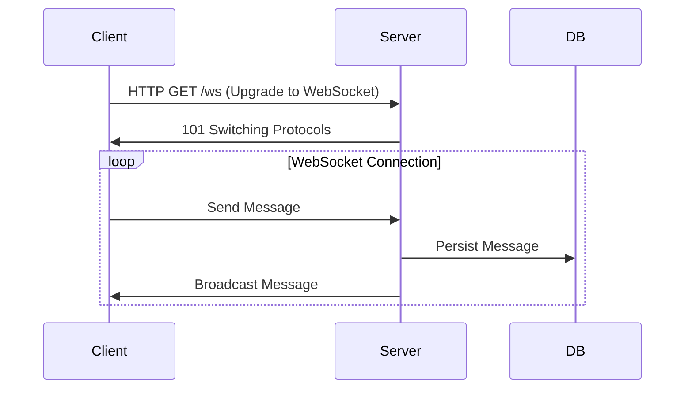

# ChatApp - Sistema de Chat em Tempo Real com WebSocket

## 📝 Visão Geral
O **ChatApp** é um sistema de mensagens em tempo real desenvolvido em **Go**, utilizando **WebSocket** para comunicação bidirecional entre clientes e servidor. O projeto oferece:

- Comunicação em tempo real entre usuários
- Histórico de mensagens persistente
- Status online/offline dos usuários
- Autenticação segura via JWT
- Arquitetura limpa e escalável

## 🏗️ Estrutura do Projeto

```
chat-app/
├── cmd/
│   └── server/
│       └── main.go          # Ponto de entrada da aplicação
├── internal/
│   ├── config/
│   │   └── config.go        # Configurações da aplicação
│   ├── handlers/
│   │   ├── auth.go          # Middleware de autenticação
│   │   ├── common.go        # Utilitários compartilhados
│   │   ├── messages.go      # Manipuladores de mensagens
│   │   ├── routes.go        # Configuração de rotas
│   │   ├── status.go        # Manipuladores de status
│   │   └── websocket.go     # Manipulador WebSocket
│   ├── models/
│   │   ├── message.go       # Modelo de mensagem
│   │   └── user_status.go   # Modelo de status do usuário
│   ├── repository/
│   │   ├── message_repo.go  # Operações de banco para mensagens
│   │   └── status_repo.go   # Operações de banco para status
│   ├── service/
│   │   ├── auth_service.go      # Serviço de autenticação
│   │   ├── message_service.go   # Serviço de mensagens
│   │   └── status_service.go    # Serviço de status
│   └── websocket/
│       ├── client.go        # Cliente WebSocket
│       ├── hub.go           # Hub WebSocket
│       └── message.go       # Mensagens WebSocket
├── pkg/
│   └── jwt/
│       └── jwt.go           # Utilitários JWT
├── go.mod                   # Definição do módulo Go
├── go.sum                   # Dependências do módulo
├── .env.example             # Exemplo de variáveis de ambiente
└── README.md                # Este arquivo
```

## 🚀 Começando

### Pré-requisitos

- Go 1.21+
- MySQL 8.0+
- Git

### Instalação

Clone o repositório:

```bash
git clone https://github.com/FelipePn10/chatapp.git
cd chatapp
```

Configure o ambiente:

```bash
cp .env.example .env
# Edite o .env com suas configurações
```

Instale as dependências:

```bash
go mod tidy
```

Inicie o servidor:

```bash
go run cmd/server/main.go
```

## 🔧 Configuração

| Variável     | Descrição                     | Padrão     |
|--------------|-------------------------------|------------|
| PORT         | Porta do servidor             | 8081       |
| DB_USER      | Usuário do MySQL              | root       |
| DB_PASSWORD  | Senha do MySQL                | ""         |
| DB_HOST      | Host do MySQL                 | localhost  |
| DB_NAME      | Nome do banco de dados        | chat_db    |
| JWT_SECRET   | Segredo para tokens JWT       | -          |
| LOG_LEVEL    | Nível de logging              | info       |

## 📚 Documentação da API

### Autenticação

Requer token JWT no header `Authorization: Bearer <token>`

### Endpoints

#### WebSocket

```http
GET /ws
```

Estabelece conexão WebSocket para comunicação em tempo real

#### Mensagens

```http
GET /api/messages/history?user_id=<id>&limit=<n>
```

Retorna histórico de mensagens

#### Status

```http
GET /api/users/status?user_id=<id>
```

Retorna status dos usuários

#### Health Check

```http
GET /health
```

Verifica status do servidor

## 🛠️ Tecnologias Utilizadas

- **Linguagem**: Go 1.21+
- **Banco de Dados**: MySQL 8.0
- **WebSocket**: gorilla/websocket
- **Autenticação**: JWT
- **Logging**: zerolog
- **Router**: gorilla/mux
- **Configuração**: godotenv

## 🧠 Arquitetura

```
Client → HTTP/WS → Handlers → Services → Repositories → Database
                  ↑           ↑          ↑
                  │           │          └── Persistência
                  │           └── Lógica de negócio
                  └── Controllers/Rotas
```

## 📊 Diagrama de Fluxo



## 🧪 Testes

Para executar os testes:

```bash
go test ./...
```

## 📦 Implantação

### Docker

```bash
docker build -t chatapp .
docker run -p 8081:8081 --env-file .env chatapp
```

### Kubernetes (Exemplo)

```yaml
apiVersion: apps/v1
kind: Deployment
metadata:
  name: chatapp
spec:
  replicas: 3
  template:
    spec:
      containers:
      - name: chatapp
        image: chatapp:latest
        ports:
        - containerPort: 8081
        envFrom:
        - secretRef:
            name: chatapp-secrets
```

## 🤝 Contribuição

1. Faça um fork do projeto
2. Crie sua branch (`git checkout -b feature/AmazingFeature`)
3. Commit suas mudanças (`git commit -m 'Add some AmazingFeature'`)
4. Push para a branch (`git push origin feature/AmazingFeature`)
5. Abra um Pull Request

## 📄 Licença

Distribuído sob a licença MIT. Veja `LICENSE` para mais informações.

## ✉️ Contato

Felipe Panosso - [panossodev@example.com](mailto:felipe@example.com)  
Link do Projeto: [https://github.com/FelipePn19/chatapp](https://github.com/FelipePn10/chatapp)